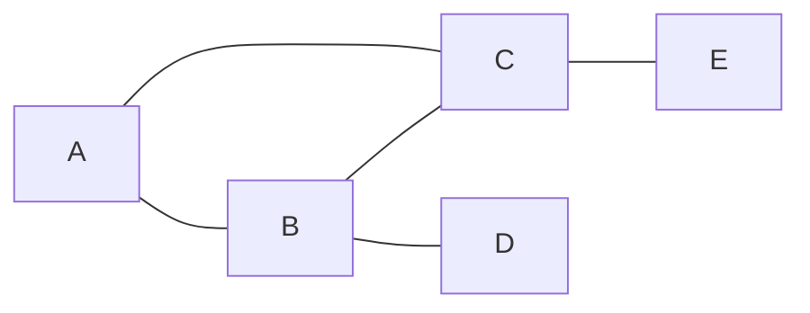

Nama: Dafta Ayyasy  
NIM: 2211310121  
Mata Kuliah: Analisis Jejaring Sosial  
Kelas: Weekend(8c)  

# Analisis-Jejaring-Sosial
Jawaban UTS Matakuliah Analisis Jejaring Sosial

## 1. Representasi Graf Jejaring Komunikasi
### Konsep Representasi Graf
Dalam Analisis Jejaring Sosial (SNA), hubungan komunikasi dalam organisasi dapat dimodelkan menggunakan graf.

- Node (simpul) merepresentasikan anggota organisasi
- Edge (sisi) merepresentasikan hubungan komunikasi antar anggota

Dengan pendekatan ini, kita dapat melihat pola interaksi, mengidentifikasi anggota yang dominan, serta mendeteksi potensi hambatan komunikasi.

### Jenis Graf yang Digunakan
Berdasarkan karakteristik komunikasi dalam organisasi:

- Graf Tak Berarah (Undirected Graph)

Graf ini tidak memiliki arah, karena komunikasi diasumsikan terjadi dua arah (jika A berkomunikasi dengan B, maka B juga berkomunikasi dengan A).

- Graf Tidak Berbobot (Unweighted Graph)

Graf ini tidak memiliki bobot, karena hanya menunjukkan:

ada hubungan komunikasi → diberi nilai 1  
tidak ada hubungan → diberi nilai 0

### Contoh Kasus (5 Anggota)

Misalkan terdapat 5 anggota (*node*):

A, B, C, D, E

Hubungan komunikasi yang terjadi (*edge*):

A ↔ B  
A ↔ C  
B ↔ C  
B ↔ D  
C ↔ E  
(Tidak mempertimbangkan intensitas/frekuensi komunikasi)

Diagram Graf

### Matriks Adjacency  
Matriks adjacency digunakan untuk merepresentasikan graf dalam bentuk tabel:

|   | A | B | C | D | E |
|---|---|---|---|---|---|
| A | 0 | 1 | 1 | 0 | 0 |
| B | 1 | 0 | 1 | 1 | 0 |
| C | 1 | 1 | 0 | 0 | 1 |
| D | 0 | 1 | 0 | 0 | 0 |
| E | 0 | 0 | 1 | 0 | 0 |

Penjelasan Matriks  
Nilai 1 menunjukkan adanya hubungan komunikasi  
Nilai 0 menunjukkan tidak ada hubungan  
Matriks bersifat simetris, karena graf tidak berarah  

Kesimpulan

Representasi graf ini menunjukkan bahwa:

- Komunikasi dalam organisasi dapat dimodelkan secara sistematis  
- Struktur jaringan cenderung tidak merata  
- Terdapat anggota yang lebih terhubung dibanding yang lain  

## 2. Centrality
Degree centrality menunjukkan jumlah koneksi langsung yang dimiliki setiap node.
### Degree Centrality
- A = 2
- B = 3
- C = 3
- D = 1
- E = 1

Kesimpulan:  
Node B dan C adalah yang paling populer karena memiliki koneksi terbanyak.

### Betweenness Centrality
Betweenness centrality mengukur seberapa sering suatu node menjadi perantara dalam jalur komunikasi.  

- B menjadi penghubung antara D dengan node lain  
- C menjadi penghubung antara E dengan node lain

Kesimpulan:  
Node B dan C berperan sebagai bridge (jembatan komunikasi).

### Closeness Centrality
Closeness centrality mengukur kedekatan suatu node terhadap semua node lain (berdasarkan jarak terpendek).  

- A = 0.67  
- B = 0.80  
- C = 0.80  

Kesimpulan:  
Node B dan C adalah yang paling cepat dalam menyebarkan informasi.
- Paling populer → B dan C
- Penghubung utama → B dan C
- Penyebar tercepat → B dan C
---

## 3. Analisis Global
- Density

Rumus:

$$
Density = \frac{2E}{N(N-1)}
$$

Dengan:
- E = jumlah edge
- N = jumlah node

Perhitungan:

$$
Density = \frac{2(5)}{5(4)} = \frac{10}{20} = 0.5
$$

Kesimpulan:  
Jejaring memiliki kepadatan sedang.  

- Diameter  

Diameter adalah jarak terjauh antara dua node dalam jaringan.  

Jarak terjauh: D → E = 3 langkah  
Diameter = 3  

- Average Path Length  

Rata-rata jarak antar node ≈ 1.7  

- Karakteristik Jaringan

Ciri-ciri:  

Terdapat node pusat (B dan C)  
Terdapat node pinggiran (D dan E)  

Kesimpulan:  
Jaringan cenderung semi scale-free (berbasis hub)  

---

## 4. Eigenvector Centrality
Eigenvector centrality mengukur pengaruh node berdasarkan kualitas koneksinya.
- Ranking:  
C ≈ B > A > D ≈ E
- Analisis:  
B dan C memiliki pengaruh tinggi karena terhubung dengan banyak node  
A tetap cukup berpengaruh karena terhubung dengan node penting (B dan C)  
D dan E memiliki pengaruh rendah  

- Perbandingan dengan Degree Centrality:  
Degree hanya melihat jumlah koneksi  
Eigenvector melihat kualitas  

Node dengan koneksi sedikit tetap bisa berpengaruh jika terhubung ke node penting.

---

## 5. Integrasi Metrik Sentralitas & Strategi Mitigasi

Identifikasi Node Kunci  

Berdasarkan hasil analisis seluruh metrik sentralitas, yaitu:  

Degree Centrality → jumlah koneksi langsung  
Betweenness Centrality → peran sebagai penghubung  
Closeness Centrality → kecepatan menjangkau node lain  
Eigenvector Centrality → pengaruh berdasarkan kualitas koneksi  

Diperoleh bahwa node B dan C merupakan anggota paling penting dalam jaringan.  

Alasan Pemilihan Node Kunci
- Node B  
Memiliki degree tinggi (banyak koneksi langsung)  
Menjadi penghubung utama bagi node D  
Memiliki closeness tinggi (akses cepat ke seluruh jaringan)  
Berkontribusi besar dalam aliran informasi  
- Node C  
Memiliki degree tinggi  
Menjadi penghubung utama bagi node E  
Memiliki closeness tinggi  
Memiliki eigenvector tinggi karena terhubung dengan node penting  
Kesimpulan Node Kunci  

Node kunci dalam jaringan adalah:  

B  
C  

Keduanya berperan sebagai:  

Pusat komunikasi (hub  
Penghubung antar bagian jaringan  
Penyebar informasi utama  

- Analisis Risiko  

Ketergantungan yang tinggi pada B dan C menimbulkan beberapa risiko:  

Terputusnya komunikasi antar anggota  
Isolasi node tertentu (D dan E)  
Penurunan efisiensi penyebaran informasi  
Fragmentasi jaringan  
Strategi Mitigasi  

Untuk mengurangi ketergantungan terhadap node kunci, organisasi dapat menerapkan strategi berikut:  
1. Redundansi Koneksi  

Menambahkan jalur komunikasi alternatif:  

Menghubungkan D dengan C  
Menghubungkan E dengan B  

Tujuan: mengurangi ketergantungan pada satu jalur komunikasi  

2. Desentralisasi Komunikasi  
Mendorong komunikasi langsung antar anggota  
Mengurangi peran dominan satu atau dua individu  

Tujuan: distribusi informasi lebih merata  

3. Rotasi Peran  
Mengganti peran koordinator komunikasi secara berkala  

Tujuan: menghindari ketergantungan pada individu tertentu  

4. Sistem Dokumentasi Terpusat  
Menggunakan platform bersama (misalnya Notion atau Google Docs)  

Tujuan: informasi tetap dapat diakses tanpa bergantung pada individu  

5. Penguatan Node Menengah  
Meningkatkan peran anggota seperti A sebagai penghubung tambahan  

Tujuan: menciptakan lebih banyak “bridge” dalam jaringan  

- Kesimpulan Akhir  

Integrasi berbagai metrik sentralitas menunjukkan bahwa B dan C adalah node paling kritis dalam jaringan.  

Namun, struktur yang terlalu bergantung pada node tertentu bersifat rentan, sehingga diperlukan strategi seperti redundansi koneksi, desentralisasi komunikasi, dan penguatan anggota lain untuk meningkatkan ketahanan organisasi.
